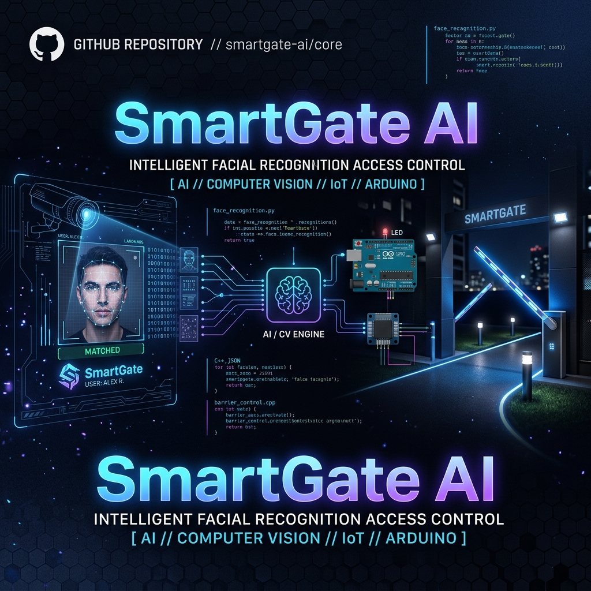
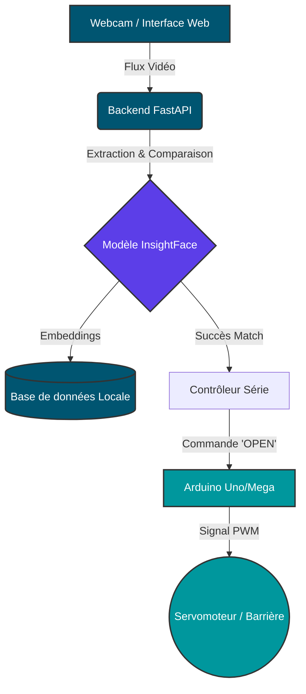

<div align="center">
  

  # SmartGate AI 🚀
  
  **Système de Contrôle d'Accès par Reconnaissance Faciale Intelligente & IoT**

  [](https://www.python.org/)
  [](https://fastapi.tiangolo.com/)
  [](https://opencv.org/)
  [](https://www.arduino.cc/)
  [](LICENSE)
</div>

---

## 📖 À propos du projet

**SmartGate AI** est une solution complète et moderne permettant de sécuriser et d'automatiser le contrôle d'accès physique à l'aide de l'Intelligence Artificielle. En combinant la puissance de la vision par ordinateur et de l'IoT, ce système offre une expérience fluide : présentez-vous devant la caméra, et si vous êtes autorisé, la barrière s'ouvre automatiquement.

Ce projet s'articule autour d'un backend robuste en **FastAPI**, exploitant le modèle de pointe **InsightFace** pour une reconnaissance biométrique ultra-précise, et communique via interface série avec une carte **Arduino** pour le contrôle physique (servomoteur).

## ✨ Fonctionnalités Clés

- 🔐 **Reconnaissance Faciale Haute Précision** : Utilisation d'InsightFace pour extraire et comparer les embeddings faciaux avec une grande fiabilité.
- ⚡ **Backend Performant (FastAPI)** : API REST rapide, asynchrone et facile à étendre.
- 📸 **Interface Web Intuitive** : Interface utilisateur pour capturer de nouveaux visages via webcam, vérifier les accès et administrer la base de données.
- 🤖 **Contrôle Matériel (IoT)** : Communication série fluide avec un Arduino pour déclencher l'ouverture/fermeture physique.
- 🛠️ **Cross-Platform** : Scripts d'exécution compatibles Linux, macOS et Windows.

## 🏗️ Architecture du Système



## 📂 Structure du Dépôt

- 📁 `web_app/` : Cœur de l'application (Backend FastAPI, logique métier).
    - 📁 `static/` : Interface utilisateur (HTML/CSS/JS).
    - 📁 `data/` : Stockage des embeddings faciaux enregistrés.
- 📁 `arduino_barriere/` : Code source C++ (`.ino`) pour le microcontrôleur Arduino.
- 📄 `webcam_recognition.py` / `test_recognition.py` : Scripts de test autonomes pour la détection pure.
- 📄 `EXECUTION_PROJET.md` : **Guide ultime d'installation et de déploiement.**

## 🚀 Démarrage Rapide

Pour un guide complet (configuration matérielle, installation des dépendances, variables d'environnement), veuillez consulter impérativement le **[Guide d'Exécution (EXECUTION_PROJET.md)](EXECUTION_PROJET.md)**.

### 1. Cloner le dépôt
```bash
git clone https://github.com/Credok12/smartgate-ai.git
cd smartgate-ai
```

### 2. Environnement & Dépendances
```bash
python -m venv venv
source venv/bin/activate  # Sous Windows : venv\Scripts\activate
pip install -r requirements.txt
```

### 3. Lancement du Serveur Web
```bash
python -m uvicorn web_app.main:app --host 127.0.0.1 --port 8000
```

🌐 **Accédez à l'interface via :** `http://127.0.0.1:8000`

## 🛠️ Stack Technique

- **Intelligence Artificielle** : `InsightFace` (Reconnaissance), `OpenCV` (Traitement d'image).
- **Backend** : `Python 3`, `FastAPI`, `Uvicorn`, `PySerial`.
- **Frontend** : `HTML5`, `CSS3`, `Vanilla JS`.
- **Hardware** : `Arduino`, Servomoteur.

## 🤝 Contribution

Les contributions sont les bienvenues ! Pour contribuer :
1. Forkez le projet.
2. Créez une branche pour votre fonctionnalité (`git checkout -b feature/AmazingFeature`).
3. Commitez vos changements (`git commit -m 'Add some AmazingFeature'`).
4. Poussez vers la branche (`git push origin feature/AmazingFeature`).
5. Ouvrez une Pull Request.

## 📝 Licence

Distribué sous la licence MIT. Voir `LICENSE` pour plus d'informations.

---
<div align="center">
  <i>Développé avec passion pour l'innovation en sécurité et IA.</i>
</div>
